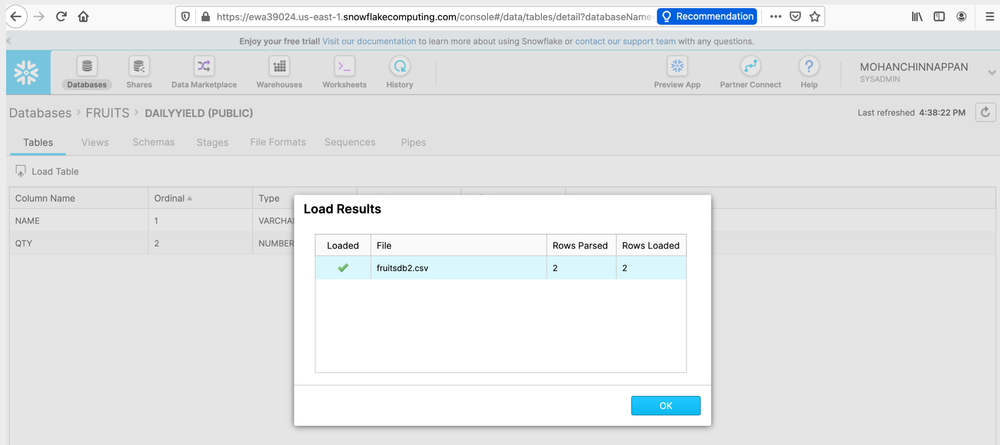
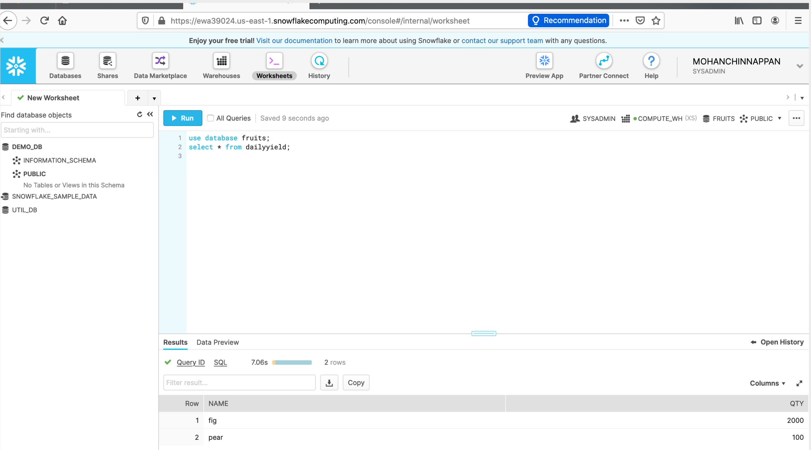

# Snowflake

## Create Database and table and load data using Snowflake UI




## Installing snowsql client for MacOs

### Download
```
$ curl -O https://sfc-repo.snowflakecomputing.com/snowsql/bootstrap/1.2/darwin_x86_64/snowsql-1.2.9-darwin_x86_64.pkg
```

### Install
```
$ sudo su installer -pkg snowsql-1.2.9-darwin_x86_64.pkg -target ~/snowflake/  
Password:

```
## Connecting to Snowflake snowsql cli


```
$  /Applications/SnowSQL.app/Contents/MacOS/snowsql -v
Version: 1.2.10

```
$  /Applications/SnowSQL.app/Contents/MacOS/snowsql -u MOHANCHINNAPPAN
Account: ewa39024.us-east-1             
Password: 
* SnowSQL * v1.2.10
Type SQL statements or !help
MOHANCHINNAPPAN#COMPUTE_WH@(no database).(no schema)>use database fruits;
+----------------------------------+                                            
| status                           |
|----------------------------------|
| Statement executed successfully. |
+----------------------------------+
1 Row(s) produced. Time Elapsed: 1.206s
MOHANCHINNAPPAN#COMPUTE_WH@FRUITS.PUBLIC>select * from dailyyield;
+------+------+                                                                 
| NAME |  QTY |
|------+------|
| fig  | 2000 |
| pear |  100 |
+------+------+
2 Row(s) produced. Time Elapsed: 3.511s
MOHANCHINNAPPAN#COMPUTE_WH@FRUITS.PUBLIC>select max(qty) from DAILYYIELD;
+----------+                                                                    
| MAX(QTY) |
|----------|
|     2000 |
+----------+
1 Row(s) produced. Time Elapsed: 2.550s
MOHANCHINNAPPAN#COMPUTE_WH@FRUITS.PUBLIC>


```
