# Snowflake data integration using DX  and Einstein Analytics (EA)

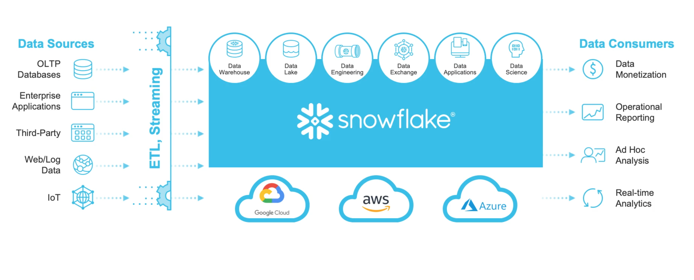 
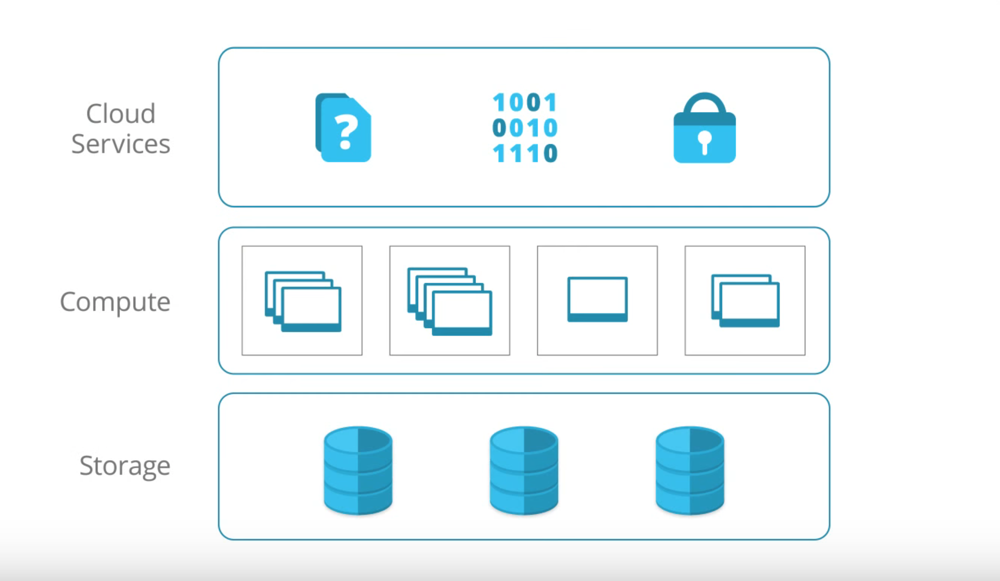 
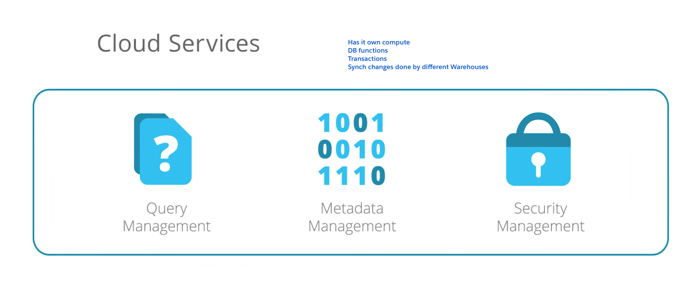 
-
- Access Snowflake data (Query)
- Load Snowflake data into EA dataset
- Insert CSV file Data into Snowflake table  
    - This CSV data file can be obtained from EA using dataset export tool as explained here: [Dataset Export](https://www.salesforceblogger.com/2020/08/19/export-your-einstein-analytics-datasets/)


## Usage demo


### Input data file
```csv
apple,100,yellow delicious
mango,77,sweetie
peach,24,eastern
```

## Using CLI to query


### Query SQL fruits-query-new.sql

```
$ cat ~/.snowflake/fruits-query-new.sql 
```
```sql

SELECT name,qty,comments FROM fruit..yield;
```

```
$  sfdx mohanc:snowflake:query -q ~/.snowflake/fruits-query-new.sql -c ~/.snowflake/sfc-connection-new.json  -f csv
```

```csv
"NAME","QTY","COMMENTS"
"apple",100,"yellow delicious"
"mango",77,"sweetie"
"peach",24,"eastern"
```
## Plugin requirements
- Requires 0.0.69 version of the plugin
    - sfdx-mohanc-plugins@0.0.69
    - [How to install the plugin](https://mohan-chinnappan-n.github.io/dx/plugins.html#/1)

## Topics
- [Query](#query)
- [Download and load into EA dataset](#loadea)
    - [More examples for Loading Data in to EA](https://github.com/mohan-chinnappan-n/cli-dx/blob/master/aws.md#loadea)
- [Create table in Snowflake](#createtable)
- [Insert data into Snowflake table](#insertdata)
- [Need to convert PSV to CSV?](https://github.com/mohan-chinnappan-n/cli-dx/tree/master/dl)
- [Looking for AWS S3 integration?](./aws.md)


<a name='query'></a>

## Querying Snowflake
### Usage
```
$ sfdx mohanc:snowflake:query -h
Query Snowflake  

USAGE
  $ sfdx mohanc:snowflake:query

OPTIONS
  -c, --connectionfilename=connectionfilename     Connection json file
  -f, --format=format                             Output format csv|json, csv is default
  -q, --queryfilename=queryfilename               SQL query file
  --json                                          format output as json
  --loglevel=(trace|debug|info|warn|error|fatal)  logging level for this command invocation

EXAMPLE

       ** Query Snowflake   **

       sfdx mohanc:snowflake:query -q <queryFile> -c <connectionPropsJSONFile> -f 'format: csv|json'

       Sample connectionPropsJSONFile
    
       {
        "account" : "myaccount",
        "username" : "myusername",
        "password" : "password"
       } 

       default format: csv
```


### Demo
- Query
```
$ cat ~/.snowflake/fruits-query.sql 
```
```sql
SELECT * FROM fruits..dailyyield;
```

- CSV output
```
$ sfdx mohanc:snowflake:query -q ~/.snowflake/fruits-query.sql -c ~/.snowflake/sfc-connection.json  -f csv
```
```csv
"NAME","QTY"
"fig",2000
"pear",100
```
- JSON output
```
$ sfdx mohanc:snowflake:query -q ~/.snowflake/fruits-query.sql -c ~/.snowflake/sfc-connection.json  -f json
```

```json
[
    {
        "NAME": "fig",
        "QTY": 2000
    },
    {
        "NAME": "pear",
        "QTY": 100
    }
]
```

<a name="loadea"></a>
## Download Snowflake results into csv file and load that intoEinstein Analytics (EA) Dataset

### Download from Snowflake into a CSV file
```
$ sfdx mohanc:snowflake:query -q ~/.snowflake/fruits-query.sql -c ~/.snowflake/sfc-connection.json  -f csv >/tmp/fruitsdbsfc.csv
```
```
$ cat /tmp/fruitsdbsfc.csv 
```

```csv
"NAME","QTY"
"fig",2000
"pear",100
```

### load into EA dataset
```
$ sfdx mohanc:ea:dataset:load -h

Dataset Loader for EA  

USAGE
  $ sfdx mohanc:ea:dataset:load

OPTIONS
  -d, --datafile=datafile                         Data file in csv format to load
  -o, --operation=operation                       Operation to perform : Overwrite|Append|Upsert|Delete
  -u, --targetusername=targetusername             username or alias for the target org; overrides default target org
  --apiversion=apiversion                         override the api version used for api requests made by this command
  --json                                          format output as json
  --loglevel=(trace|debug|info|warn|error|fatal)  logging level for this command invocation

EXAMPLE

              Loads the given csv file in EA as a dataset

              sfdx mohanc:ea:dataset:load  -u <username> -d <datafile.csv> -o Upsert

``` 

### Demo

```
$ sfdx mohanc:ea:dataset:load -u mohan.chinnappan.n_ea2@gmail.com -d  /tmp/fruitsdbsfc.csv 
{ id: '06V3h0000005kLdEAI', success: true, errors: [] }
Load part: 1
{ id: '06W3h0000006vpdEAA', success: true, errors: [] }
Going to process...
Done.
```   
- Job created
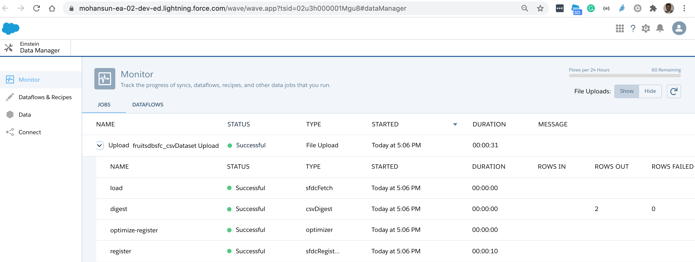

- Dataset created
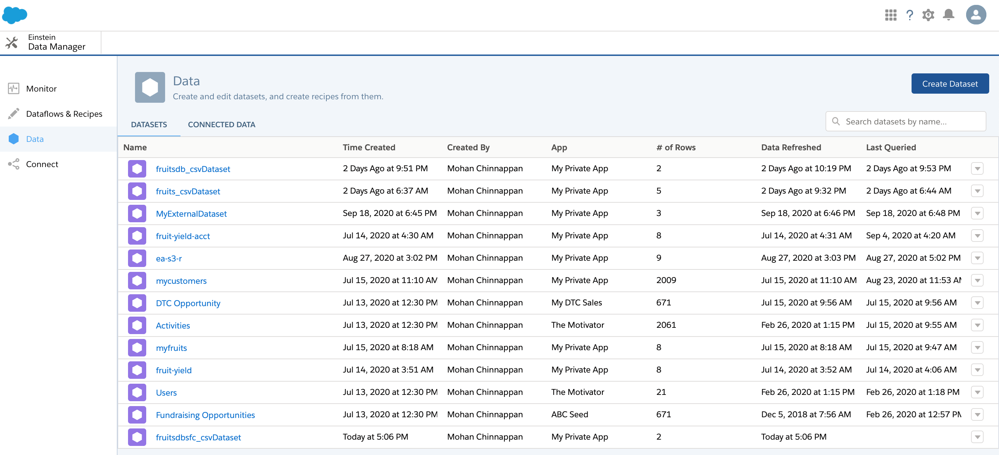

- Recipe 
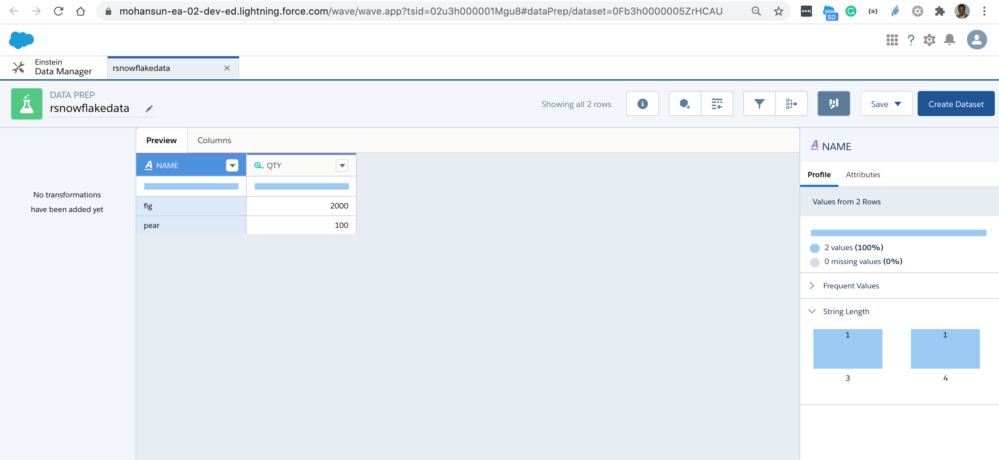

<a name='createtable'></a>
## create table in snowflake

```
$ sfdx mohanc:snowflake:query -q ~/.snowflake/stock.sql -f json -c ~/.snowflake/sfc-connection.json 
```
```json
[
    {
        "status": "table stock successfully created."
    }
]
```
```
$ cat ~/.snowflake/stock.sql 
```
```sql
create table fruits..stock ( 
   itemnum varchar(16), 
   qty integer
);
```
<a name='insertdata'></a>
## Insert data into table in snowflake

### Usage
```
$ sfdx mohanc:snowflake:insert -h
Insert data into Snowflake  

USAGE
  $ sfdx mohanc:snowflake:insert

OPTIONS
  -b, --bucketsize=bucketsize                     Data file bucket size (insert bulk of this size) - default: 124
  -c, --connectionfilename=connectionfilename     Connection json file
  -d, --datafilename=datafilename                 Data file in csv format
  -f, --fields=fields                             Fields to insert into - comma separated
  -g, --hasheader=hasheader                       Data file has header y|n (default = n)
  -o, --overwrite=overwrite                       Truncate and insert  y|n (default = n)
  -t, --tablename=tablename                       Table to insert data into
  --json                                          format output as json
  --loglevel=(trace|debug|info|warn|error|fatal)  logging level for this command invocation

EXAMPLE

       ** Insert data into Snowflake   **
       sfdx mohanc:snowflake:inset  -t <tableName> -f <Fields List in csv> -c <connectionPropsJSONFile> -d <dataFile> -g <data file has header? y/[n]> -o 
  <truncte and insert the data? y/[n]> -b <bucket size [124]>
       sfdx mohanc:snowflake:insert -t fruits..stock -f 'itemNum,qty' -c ~/.snowflake/sfc-connection.json -d ~/.snowflake/stock_noh.csv -g n -o n -b 2
       Sample connectionPropsJSONFile
       {
        "account" : "myaccount",
        "username" : "myusername",
        "password" : "password"
       }
```

- *NOTE*: This CSV file can come from EA dataset extract utility as explained here: [Dataset export](https://www.salesforceblogger.com/2020/08/19/export-your-einstein-analytics-datasets/) 

```

$ cat ~/.snowflake/stock.csv
```
```csv
itemNum,qty
30001,99
40001,30
50002,77
88888,78
```

```
$ sfdx mohanc:snowflake:insert -t fruits..stock -f 'itemNum,qty' -c ~/.snowflake/sfc-connection.json -d ~/.snowflake/stock.csv -g y -o y -b 2
```
- NOTE: here I have given bucket size as 2 records per insert and Overwrite(truncate) as **y** and data file has header ( -g has **y**)
    - if the data file has no header set -g flag as **n**
```json
[
    {
        "number of rows inserted": 2
    }
]
[
    {
        "number of rows inserted": 2
    }
]
```

### Let us query to check the inserts
```
$ cat ~/.snowflake/stock-query.sql 
```
```sql
SELECT * FROM fruits..stock;
```
```
$ sfdx mohanc:snowflake:query -q ~/.snowflake/stock-query.sql -f json -c ~/.snowflake/sfc-connection.json [
```
```json
    {
        "ITEMNUM": "30001",
        "QTY": 99
    },
    {
        "ITEMNUM": "88888",
        "QTY": 78
    },
    {
        "ITEMNUM": "50002",
        "QTY": 77
    },
    {
        "ITEMNUM": "40001",
        "QTY": 30
    }
]
```
## OAuth2 setup
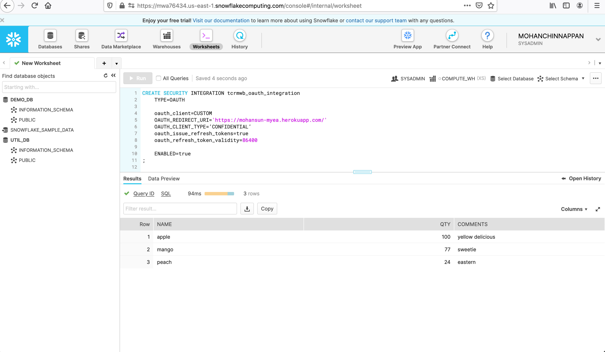
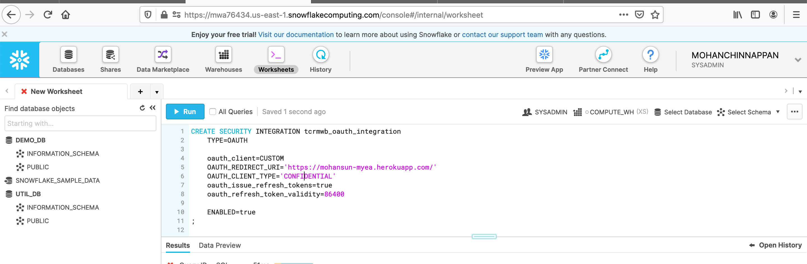
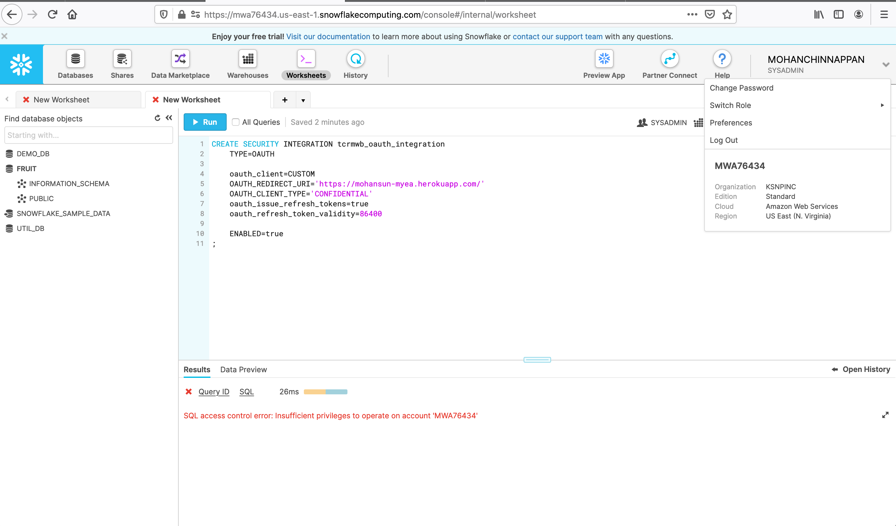
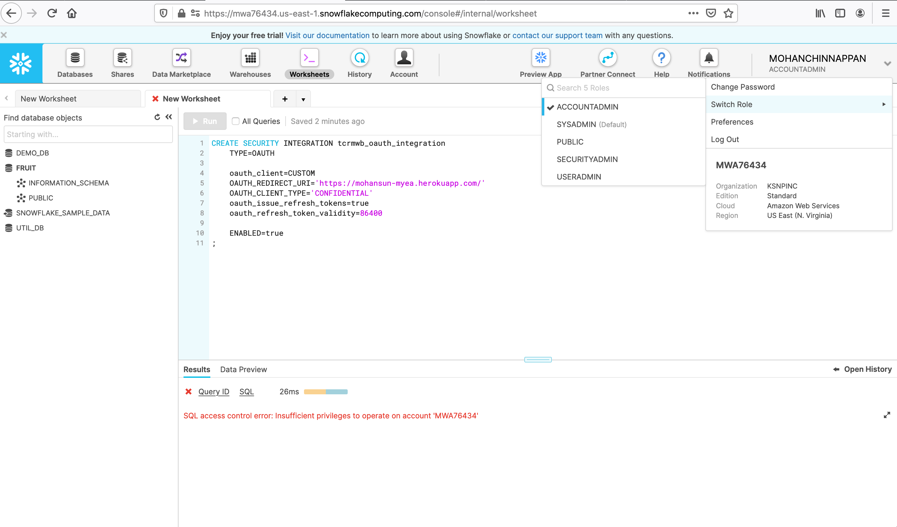
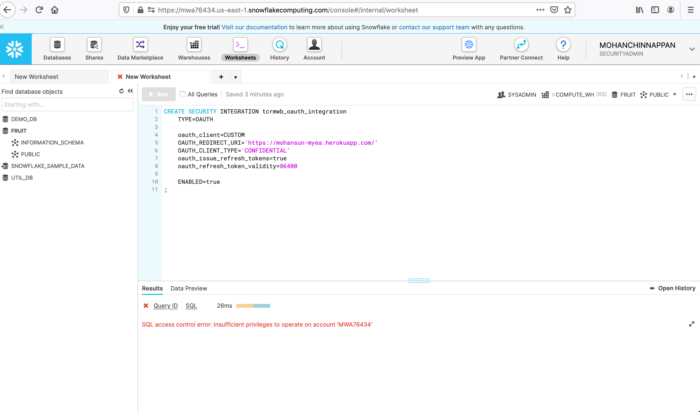
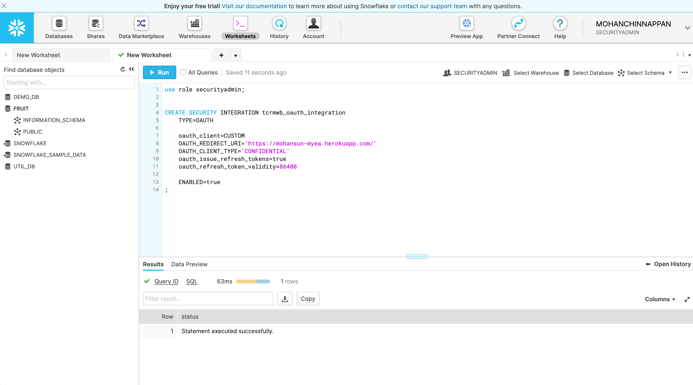
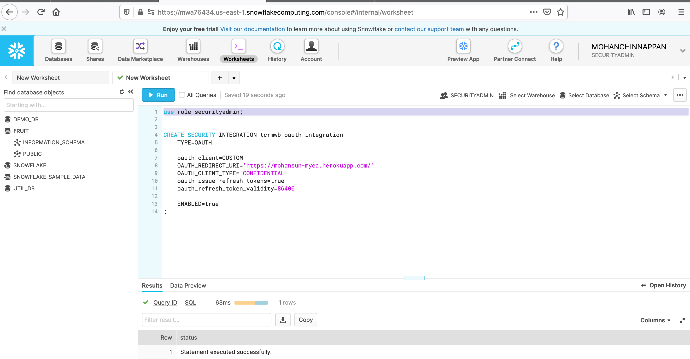
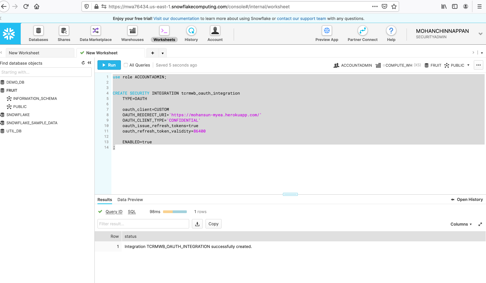
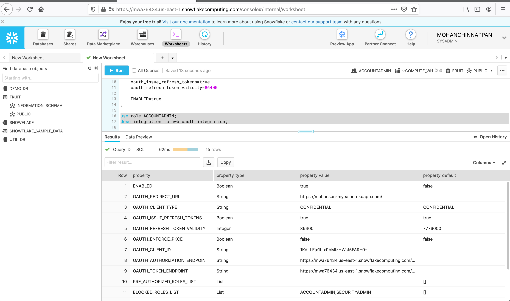
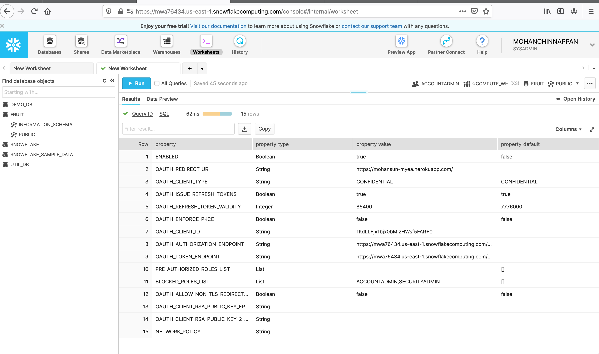
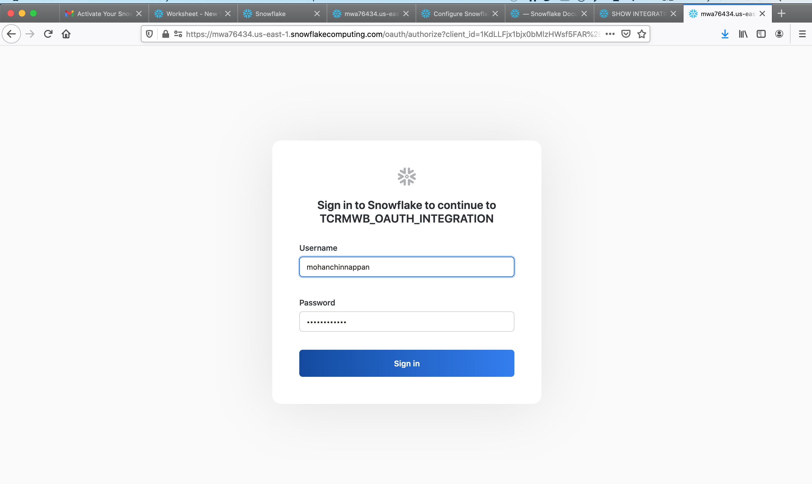


