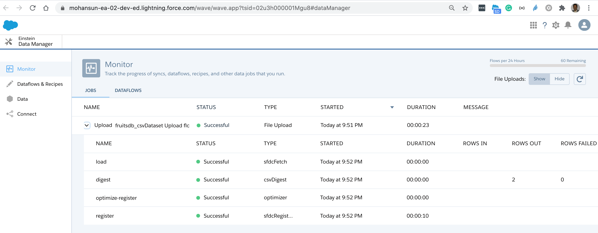
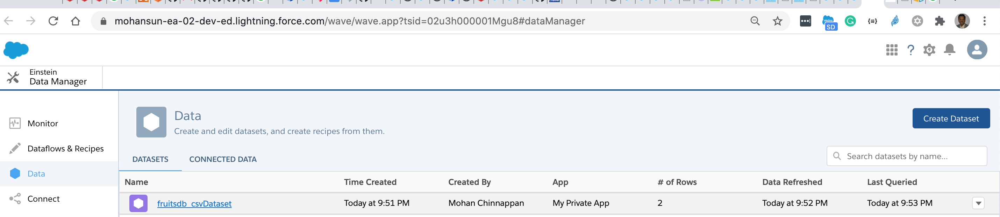
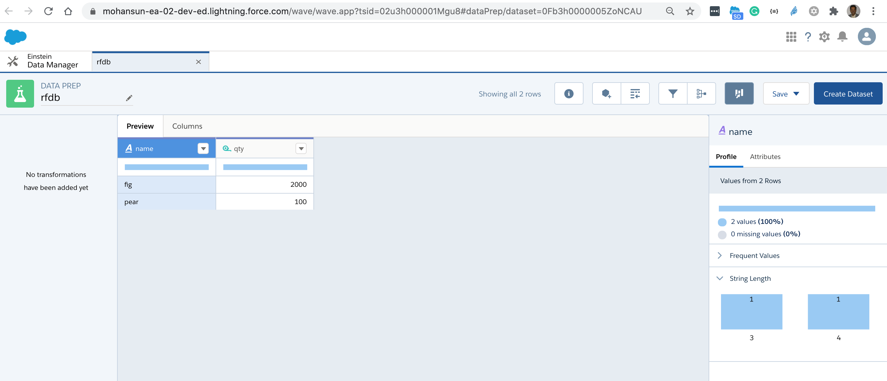

# Accessing snowflake using DX

## Index
- [Query](#query)


<a name='query'></a>

## Querying Snowflake
### Usage
```
$ sfdx mohanc:snowflake:query -h
Query Snowflake  

USAGE
  $ sfdx mohanc:snowflake:query

OPTIONS
  -c, --connectionfilename=connectionfilename     Connection json file
  -f, --format=format                             Output format csv|json, csv is default
  -q, --queryfilename=queryfilename               SQL query file
  --json                                          format output as json
  --loglevel=(trace|debug|info|warn|error|fatal)  logging level for this command invocation

EXAMPLE

       ** Query Snowflake   **

       sfdx mohanc:snowflake:query -q <queryFile> -c <connectionPropsJSONFile> -f 'format: csv|json'

       Sample connectionPropsJSONFile
    
       {
        "account" : "myaccount",
        "username" : "myusername",
        "password" : "password"
       } 

       default format: csv
```


### Demo
- CSV output
```
$ sfdx mohanc:snowflake:query -q ~/.snowflake/fruits-query.sql -c ~/.snowflake/sfc-connection.json  -f csv
```
```csv
"NAME","QTY"
"fig",2000
"pear",100
```
- JSON output
```
$ sfdx mohanc:snowflake:query -q ~/.snowflake/fruits-query.sql -c ~/.snowflake/sfc-connection.json  -f json
```

```json
[
    {
        "NAME": "fig",
        "QTY": 2000
    },
    {
        "NAME": "pear",
        "QTY": 100
    }
]
```

<a name="loadea"></a>
# Load the downloaded Snowflake results csv file into Einstein Analytics (EA) Dataset

## Usage
```
$ sfdx mohanc:ea:dataset:load -h

Dataset Loader for EA  

USAGE
  $ sfdx mohanc:ea:dataset:load

OPTIONS
  -d, --datafile=datafile                         Data file in csv format to load
  -o, --operation=operation                       Operation to perform : Overwrite|Append|Upsert|Delete
  -u, --targetusername=targetusername             username or alias for the target org; overrides default target org
  --apiversion=apiversion                         override the api version used for api requests made by this command
  --json                                          format output as json
  --loglevel=(trace|debug|info|warn|error|fatal)  logging level for this command invocation

EXAMPLE

              Loads the given csv file in EA as a dataset

              sfdx mohanc:ea:dataset:load  -u <username> -d <datafile.csv> -o Upsert

``` 

### Demo

```
$ sfdx mohanc:ea:dataset:load -u mohan.chinnappan.n_ea2@gmail.com  -d /tmp/fruitsdb.csv 
{ id: '06V3h0000005jgzEAA', success: true, errors: [] }
Load part: 1
{ id: '06W3h0000006vAuEAI', success: true, errors: [] }
Going to process...

Done.
```   
- Job created


- Dataset created


- Recipe 

