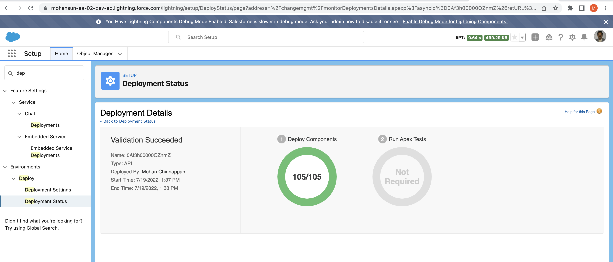
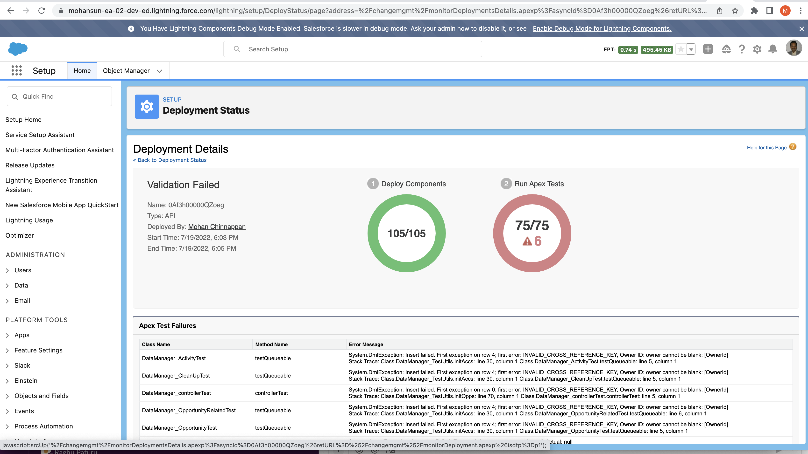

# Deployment validations using force:source commands


## Login into the org
```
sfdx force:auth:web:login
Successfully authorized mohan.chinnappan.n_ea2@gmail.com with org ID 00D3h000007R1LuEAK

```
## Create DX Project (say: validate1)
```
mkdir ~/.prj
cd ~/.prj
sfdx force:project:create -n validate1
```

```
ls ~/.prj/validate1
cd validate1

ls  
README.md		force-app		package.json		sfdx-project.json
config			jest.config.js		scripts
```


## Retrieve (for example ApexClass)

```
sfdx force:source:retrieve -u mohan.chinnappan.n_ea2@gmail.com  -m ApexClass 

```

```
Preparing retrieve request... done
=== Retrieved Source

 FULL NAME                               TYPE      PROJECT PATH                                                                        
 ─────────────────────────────────────── ───────── ─────────────────────────────────────────────────────────────────────────────────── 
 AccessToken                             ApexClass force-app/main/default/classes/AccessToken.cls  
 ...
```

## List the retrieved 
```
ls force-app/main/default/classes 
AccessToken.cls						LightningLoginFormController.cls-meta.xml
AccessToken.cls-meta.xml				LightningLoginFormControllerTest.cls
...
```


## Quick deploy
```
sfdx force:source:deploy -u mohan.chinnappan.n_ea2@gmail.com  -m ApexClass -c 

```
```
*** Deploying with SOAP API v55.0 ***
Deploy ID: 0Af3h00000QZnmZCAT
DEPLOY PROGRESS | ████████████████████████████████████████ | 105/105 Components
Successfully validated the deployment. 105 components deployed and 0 tests run.

```
- 


## Can I Do it in a single script

- Yes

### Bash script
- [Script](./validate.sh)
- make it executable ```chmod +x validate.sh```
```bash

#!/bin/bash
##--------------------------------------##
# validate.sh
# Purpose: Validating the given metadata type(s) from a source org against a target org

# - mohan chinnappan jul-19-2022 - creation
# - <your_name> date - <your contributions>
##-------------------------------------##

# check for the args
if [[ "$#" -ne 6 ]] 
then
     echo "=== Validate script ==="
     echo "usage: ./validate.sh  <SRC PROD|SBX> <PRJ_Name> <SRC_UserName> <MetadataTypes - in command separated> <TARGET PROD|SBX> <TARGET_UserName>"
     echo "Example: usage: ./validate.sh  PROD validate2 mohan.chinnappan.n_ea2@gmail.com ApexClass PROD mohan.chinnappan.n_ea2@gmail.com "
     exit 0 
fi

mkdir ~/.prj
cd ~/.prj

# Read commandline args
# usage bash validate.sh PROD validate2 mohan.chinnappan.n_ea2@gmail.com ApexClass 
sbx_prod=$1
project=$2
un=$3
mt=$4

tsbx_prod=$5
tun=$6


echo "=== Login into the Source org ==="

if [ ["$sbx_prod" == "SBX"] ] 
then
	sfdx force:auth:web:login -r https://test.salesforce.com
else 
	sfdx force:auth:web:login -r https://login.salesforce.com
fi

echo "=== Creating the the project $project ... ==="
sfdx force:project:create -n $project 

cd validate2
ls -l


echo  "=== Retrieving source for the metadata type(s): $mt ... ==="
sfdx force:source:retrieve -u $un  -m $mt 

ls -l

echo "=== Login into the Target org ==="

if [ ["$tsbx_prod" == "SBX"] ] 
then
	sfdx force:auth:web:login -r https://test.salesforce.com
else 
	sfdx force:auth:web:login -r https://login.salesforce.com
fi


echo  "=== Validating the source for the quick deployment ... ==="

sfdx force:source:deploy -u $tun  -m $mt -c -l RunLocalTests

echo "=== Opening the org for checking the deployment status ... ==="
sfdx force:org:open -u $un  -p lightning/setup/DeployStatus/home


```
###  Demo
```
=== Validate script ===
usage: ./validate.sh  <SRC PROD|SBX> <PRJ_Name> <SRC_UserName> <MetadataTypes - in command separated> <TARGET PROD|SBX> <TARGET_UserName>
Example: usage: ./validate.sh  PROD validate2 mohan.chinnappan.n_ea2@gmail.com ApexClass PROD mohan.chinnappan.n_ea2@gmail.com 


./validate.sh  PROD validate2 mohan.chinnappan.n_ea2@gmail.com ApexClass PROD mohan.chinnappan.n_ea2@gmail.com 
mkdir: /Users/mchinnappan/.prj: File exists

=== Login into the Source org ===
Successfully authorized mohan.chinnappan.n_ea2@gmail.com with org ID 00D3h000007R1LuEAK

=== Creating the the project validate2 ... ===
target dir = /Users/mchinnappan/.prj
identical validate2/config/project-scratch-def.json
identical validate2/README.md
identical validate2/sfdx-project.json
identical validate2/.husky/pre-commit
identical validate2/.vscode/extensions.json
identical validate2/.vscode/launch.json
identical validate2/.vscode/settings.json
identical validate2/force-app/main/default/lwc/.eslintrc.json
identical validate2/force-app/main/default/aura/.eslintrc.json
identical validate2/scripts/soql/account.soql
identical validate2/scripts/apex/hello.apex
identical validate2/.eslintignore
identical validate2/.forceignore
identical validate2/.gitignore
identical validate2/.prettierignore
identical validate2/.prettierrc
identical validate2/jest.config.js
identical validate2/package.json

total 32
-rw-r--r--  1 mchinnappan  staff  1251 Jul 19 17:07 README.md
drwxr-xr-x  3 mchinnappan  staff    96 Jul 19 17:07 config
drwxr-xr-x  3 mchinnappan  staff    96 Jul 19 17:07 force-app
-rw-r--r--  1 mchinnappan  staff   170 Jul 19 17:07 jest.config.js
-rw-r--r--  1 mchinnappan  staff  1386 Jul 19 17:07 package.json
drwxr-xr-x  4 mchinnappan  staff   128 Jul 19 17:07 scripts
-rw-r--r--  1 mchinnappan  staff   217 Jul 19 17:07 sfdx-project.json

=== Retrieving source for the metadata type(s): ApexClass ... ===
Preparing retrieve request... done
=== Retrieved Source

 FULL NAME                               TYPE      PROJECT PATH                                                                        
 ─────────────────────────────────────── ───────── ─────────────────────────────────────────────────────────────────────────────────── 
 AccessToken                             ApexClass force-app/main/default/classes/AccessToken.cls                                      
 AccessToken                             ApexClass force-app/main/default/classes/AccessToken.cls-meta.xml                             
 AccountController                       ApexClass force-app/main/default/classes/AccountController.cls                                
 AccountController                       ApexClass force-app/main/default/classes/AccountController.cls-meta.xml                       
 AccountRESTController                   ApexClass force-app/main/default/classes/AccountRESTController.cls                            
 AccountRESTController                   ApexClass force-app/main/default/classes/AccountRESTController.cls-meta.xml                   
 ApexClassForTests                       ApexClass force-app/main/default/classes/ApexClassForTests.cls                                
 ApexClassForTests                       ApexClass force-app/main/default/classes/ApexClassForTests.cls-meta.xml                       
 ApexParser                              ApexClass force-app/main/default/classes/ApexParser.cls                                       
 ApexParser                              ApexClass force-app/main/default/classes/ApexParser.cls-meta.xml                              
 ApexStepData                            ApexClass force-app/main/default/classes/ApexStepData.cls                                     
 ApexStepData                            ApexClass force-app/main/default/classes/ApexStepData.cls-meta.xml                            
 AsyncExecutionExample                   ApexClass force-app/main/default/classes/AsyncExecutionExample.cls                            
 AsyncExecutionExample                   ApexClass force-app/main/default/classes/AsyncExecutionExample.cls-meta.xml                   
 AutocreatedRegHandler1618428423355      ApexClass force-app/main/default/classes/AutocreatedRegHandler1618428423355.cls               
 AutocreatedRegHandler1618428423355      ApexClass force-app/main/default/classes/AutocreatedRegHandler1618428423355.cls-meta.xml      
 ChangePasswordController                ApexClass force-app/main/default/classes/ChangePasswordController.cls                         
 ChangePasswordController                ApexClass force-app/main/default/classes/ChangePasswordController.cls-meta.xml                
 ChangePasswordControllerTest            ApexClass force-app/main/default/classes/ChangePasswordControllerTest.cls                     
 ChangePasswordControllerTest            ApexClass force-app/main/default/classes/ChangePasswordControllerTest.cls-meta.xml            
 ClassDiagramCreatorCtrl                 ApexClass force-app/main/default/classes/ClassDiagramCreatorCtrl.cls                          
 ClassDiagramCreatorCtrl                 ApexClass force-app/main/default/classes/ClassDiagramCreatorCtrl.cls-meta.xml                 
 CodeMetrics                             ApexClass force-app/main/default/classes/CodeMetrics.cls                                      
 CodeMetrics                             ApexClass force-app/main/default/classes/CodeMetrics.cls-meta.xml                             
 CommunitiesLandingController            ApexClass force-app/main/default/classes/CommunitiesLandingController.cls                     
 CommunitiesLandingController            ApexClass force-app/main/default/classes/CommunitiesLandingController.cls-meta.xml            
 CommunitiesLandingControllerTest        ApexClass force-app/main/default/classes/CommunitiesLandingControllerTest.cls                 
 CommunitiesLandingControllerTest        ApexClass force-app/main/default/classes/CommunitiesLandingControllerTest.cls-meta.xml        
 CommunitiesLoginController              ApexClass force-app/main/default/classes/CommunitiesLoginController.cls                       
 CommunitiesLoginController              ApexClass force-app/main/default/classes/CommunitiesLoginController.cls-meta.xml              
 CommunitiesLoginControllerTest          ApexClass force-app/main/default/classes/CommunitiesLoginControllerTest.cls                   
 CommunitiesLoginControllerTest          ApexClass force-app/main/default/classes/CommunitiesLoginControllerTest.cls-meta.xml          
 CommunitiesSelfRegConfirmController     ApexClass force-app/main/default/classes/CommunitiesSelfRegConfirmController.cls              
 CommunitiesSelfRegConfirmController     ApexClass force-app/main/default/classes/CommunitiesSelfRegConfirmController.cls-meta.xml     
 CommunitiesSelfRegConfirmControllerTest ApexClass force-app/main/default/classes/CommunitiesSelfRegConfirmControllerTest.cls          
 CommunitiesSelfRegConfirmControllerTest ApexClass force-app/main/default/classes/CommunitiesSelfRegConfirmControllerTest.cls-meta.xml 
 CommunitiesSelfRegController            ApexClass force-app/main/default/classes/CommunitiesSelfRegController.cls                     
 CommunitiesSelfRegController            ApexClass force-app/main/default/classes/CommunitiesSelfRegController.cls-meta.xml            
 CommunitiesSelfRegControllerTest        ApexClass force-app/main/default/classes/CommunitiesSelfRegControllerTest.cls                 
 CommunitiesSelfRegControllerTest        ApexClass force-app/main/default/classes/CommunitiesSelfRegControllerTest.cls-meta.xml        
 DataManager_Activity                    ApexClass force-app/main/default/classes/DataManager_Activity.cls                             
 DataManager_Activity                    ApexClass force-app/main/default/classes/DataManager_Activity.cls-meta.xml                    
 DataManager_ActivityTest                ApexClass force-app/main/default/classes/DataManager_ActivityTest.cls                         
 DataManager_ActivityTest                ApexClass force-app/main/default/classes/DataManager_ActivityTest.cls-meta.xml                
 DataManager_CleanUp                     ApexClass force-app/main/default/classes/DataManager_CleanUp.cls                              
 DataManager_CleanUp                     ApexClass force-app/main/default/classes/DataManager_CleanUp.cls-meta.xml                     
 DataManager_CleanUpTest                 ApexClass force-app/main/default/classes/DataManager_CleanUpTest.cls                          
 DataManager_CleanUpTest                 ApexClass force-app/main/default/classes/DataManager_CleanUpTest.cls-meta.xml                 
 DataManager_Dataflow                    ApexClass force-app/main/default/classes/DataManager_Dataflow.cls                             
 DataManager_Dataflow                    ApexClass force-app/main/default/classes/DataManager_Dataflow.cls-meta.xml                    
 DataManager_DataflowTest                ApexClass force-app/main/default/classes/DataManager_DataflowTest.cls                         
 DataManager_DataflowTest                ApexClass force-app/main/default/classes/DataManager_DataflowTest.cls-meta.xml                
 DataManager_Opportunity                 ApexClass force-app/main/default/classes/DataManager_Opportunity.cls                          
 DataManager_Opportunity                 ApexClass force-app/main/default/classes/DataManager_Opportunity.cls-meta.xml                 
 DataManager_OpportunityRelated          ApexClass force-app/main/default/classes/DataManager_OpportunityRelated.cls                   
 DataManager_OpportunityRelated          ApexClass force-app/main/default/classes/DataManager_OpportunityRelated.cls-meta.xml          
 DataManager_OpportunityRelatedTest      ApexClass force-app/main/default/classes/DataManager_OpportunityRelatedTest.cls               
 DataManager_OpportunityRelatedTest      ApexClass force-app/main/default/classes/DataManager_OpportunityRelatedTest.cls-meta.xml      
 DataManager_OpportunityTest             ApexClass force-app/main/default/classes/DataManager_OpportunityTest.cls                      
 DataManager_OpportunityTest             ApexClass force-app/main/default/classes/DataManager_OpportunityTest.cls-meta.xml             
 DataManager_Quota                       ApexClass force-app/main/default/classes/DataManager_Quota.cls                                
 DataManager_Quota                       ApexClass force-app/main/default/classes/DataManager_Quota.cls-meta.xml                       
 DataManager_QuotaTest                   ApexClass force-app/main/default/classes/DataManager_QuotaTest.cls                            
 DataManager_QuotaTest                   ApexClass force-app/main/default/classes/DataManager_QuotaTest.cls-meta.xml                   
 DataManager_TestUtils                   ApexClass force-app/main/default/classes/DataManager_TestUtils.cls                            
 DataManager_TestUtils                   ApexClass force-app/main/default/classes/DataManager_TestUtils.cls-meta.xml                   
 DataManager_Utils                       ApexClass force-app/main/default/classes/DataManager_Utils.cls                                
 DataManager_Utils                       ApexClass force-app/main/default/classes/DataManager_Utils.cls-meta.xml                       
 DataManager_UtilsTest                   ApexClass force-app/main/default/classes/DataManager_UtilsTest.cls                            
 DataManager_UtilsTest                   ApexClass force-app/main/default/classes/DataManager_UtilsTest.cls-meta.xml                   
 DataManager_controller                  ApexClass force-app/main/default/classes/DataManager_controller.cls                           
 DataManager_controller                  ApexClass force-app/main/default/classes/DataManager_controller.cls-meta.xml                  
 DataManager_controllerTest              ApexClass force-app/main/default/classes/DataManager_controllerTest.cls                       
 DataManager_controllerTest              ApexClass force-app/main/default/classes/DataManager_controllerTest.cls-meta.xml              
 ERDCreatorCtrl                          ApexClass force-app/main/default/classes/ERDCreatorCtrl.cls                                   
 ERDCreatorCtrl                          ApexClass force-app/main/default/classes/ERDCreatorCtrl.cls-meta.xml                          
 ForgotPasswordController                ApexClass force-app/main/default/classes/ForgotPasswordController.cls                         
 ForgotPasswordController                ApexClass force-app/main/default/classes/ForgotPasswordController.cls-meta.xml                
 ForgotPasswordControllerTest            ApexClass force-app/main/default/classes/ForgotPasswordControllerTest.cls                     
 ForgotPasswordControllerTest            ApexClass force-app/main/default/classes/ForgotPasswordControllerTest.cls-meta.xml            
 Fruit                                   ApexClass force-app/main/default/classes/Fruit.cls                                            
 Fruit                                   ApexClass force-app/main/default/classes/Fruit.cls-meta.xml                                   
 FuritsInv                               ApexClass force-app/main/default/classes/FuritsInv.cls                                        
 FuritsInv                               ApexClass force-app/main/default/classes/FuritsInv.cls-meta.xml                               
 FuritsManger                            ApexClass force-app/main/default/classes/FuritsManger.cls                                     
 FuritsManger                            ApexClass force-app/main/default/classes/FuritsManger.cls-meta.xml                            
 GanttChartCtrl                          ApexClass force-app/main/default/classes/GanttChartCtrl.cls                                   
 GanttChartCtrl                          ApexClass force-app/main/default/classes/GanttChartCtrl.cls-meta.xml                          
 GanttData                               ApexClass force-app/main/default/classes/GanttData.cls                                        
 GanttData                               ApexClass force-app/main/default/classes/GanttData.cls-meta.xml                               
 GeocodingService                        ApexClass force-app/main/default/classes/GeocodingService.cls                                 
 GeocodingService                        ApexClass force-app/main/default/classes/GeocodingService.cls-meta.xml                        
 GeocodingServiceTest                    ApexClass force-app/main/default/classes/GeocodingServiceTest.cls                             
 GeocodingServiceTest                    ApexClass force-app/main/default/classes/GeocodingServiceTest.cls-meta.xml                    
 IdeaController                          ApexClass force-app/main/default/classes/IdeaController.cls                                   
 IdeaController                          ApexClass force-app/main/default/classes/IdeaController.cls-meta.xml                          
 IdeaCtrl                                ApexClass force-app/main/default/classes/IdeaCtrl.cls                                         
 IdeaCtrl                                ApexClass force-app/main/default/classes/IdeaCtrl.cls-meta.xml                                
 Jdt                                     ApexClass force-app/main/default/classes/Jdt.cls                                              
 Jdt                                     ApexClass force-app/main/default/classes/Jdt.cls-meta.xml                                     
 LightningForgotPasswordController       ApexClass force-app/main/default/classes/LightningForgotPasswordController.cls                
 LightningForgotPasswordController       ApexClass force-app/main/default/classes/LightningForgotPasswordController.cls-meta.xml       
 LightningForgotPasswordControllerTest   ApexClass force-app/main/default/classes/LightningForgotPasswordControllerTest.cls            
 LightningForgotPasswordControllerTest   ApexClass force-app/main/default/classes/LightningForgotPasswordControllerTest.cls-meta.xml   
 LightningLoginFormController            ApexClass force-app/main/default/classes/LightningLoginFormController.cls                     
 LightningLoginFormController            ApexClass force-app/main/default/classes/LightningLoginFormController.cls-meta.xml            
 LightningLoginFormControllerTest        ApexClass force-app/main/default/classes/LightningLoginFormControllerTest.cls                 
 LightningLoginFormControllerTest        ApexClass force-app/main/default/classes/LightningLoginFormControllerTest.cls-meta.xml        
 LightningSelfRegisterController         ApexClass force-app/main/default/classes/LightningSelfRegisterController.cls                  
 LightningSelfRegisterController         ApexClass force-app/main/default/classes/LightningSelfRegisterController.cls-meta.xml         
 LightningSelfRegisterControllerTest     ApexClass force-app/main/default/classes/LightningSelfRegisterControllerTest.cls              
 LightningSelfRegisterControllerTest     ApexClass force-app/main/default/classes/LightningSelfRegisterControllerTest.cls-meta.xml     
 MetadataService                         ApexClass force-app/main/default/classes/MetadataService.cls                                  
 MetadataService                         ApexClass force-app/main/default/classes/MetadataService.cls-meta.xml                         
 MetadataServiceTest                     ApexClass force-app/main/default/classes/MetadataServiceTest.cls                              
 MetadataServiceTest                     ApexClass force-app/main/default/classes/MetadataServiceTest.cls-meta.xml                     
 MicrobatchSelfRegController             ApexClass force-app/main/default/classes/MicrobatchSelfRegController.cls                      
 MicrobatchSelfRegController             ApexClass force-app/main/default/classes/MicrobatchSelfRegController.cls-meta.xml             
 MicrobatchSelfRegControllerTest         ApexClass force-app/main/default/classes/MicrobatchSelfRegControllerTest.cls                  
 MicrobatchSelfRegControllerTest         ApexClass force-app/main/default/classes/MicrobatchSelfRegControllerTest.cls-meta.xml         
 MultiselectController                   ApexClass force-app/main/default/classes/MultiselectController.cls                            
 MultiselectController                   ApexClass force-app/main/default/classes/MultiselectController.cls-meta.xml                   
 MultiselectControllerTest               ApexClass force-app/main/default/classes/MultiselectControllerTest.cls                        
 MultiselectControllerTest               ApexClass force-app/main/default/classes/MultiselectControllerTest.cls-meta.xml               
 MyProfilePageController                 ApexClass force-app/main/default/classes/MyProfilePageController.cls                          
 MyProfilePageController                 ApexClass force-app/main/default/classes/MyProfilePageController.cls-meta.xml                 
 MyProfilePageControllerTest             ApexClass force-app/main/default/classes/MyProfilePageControllerTest.cls                      
 MyProfilePageControllerTest             ApexClass force-app/main/default/classes/MyProfilePageControllerTest.cls-meta.xml             
 OpportunityController                   ApexClass force-app/main/default/classes/OpportunityController.cls                            
 OpportunityController                   ApexClass force-app/main/default/classes/OpportunityController.cls-meta.xml                   
 PagedResult                             ApexClass force-app/main/default/classes/PagedResult.cls                                      
 PagedResult                             ApexClass force-app/main/default/classes/PagedResult.cls-meta.xml                             
 PlantUMLClassDiagram                    ApexClass force-app/main/default/classes/PlantUMLClassDiagram.cls                             
 PlantUMLClassDiagram                    ApexClass force-app/main/default/classes/PlantUMLClassDiagram.cls-meta.xml                    
 PlantUMLERDiagram                       ApexClass force-app/main/default/classes/PlantUMLERDiagram.cls                                
 PlantUMLERDiagram                       ApexClass force-app/main/default/classes/PlantUMLERDiagram.cls-meta.xml                       
 PropertyController                      ApexClass force-app/main/default/classes/PropertyController.cls                               
 PropertyController                      ApexClass force-app/main/default/classes/PropertyController.cls-meta.xml                      
 SOQLControllerInjection                 ApexClass force-app/main/default/classes/SOQLControllerInjection.cls                          
 SOQLControllerInjection                 ApexClass force-app/main/default/classes/SOQLControllerInjection.cls-meta.xml                 
 SampleDataController                    ApexClass force-app/main/default/classes/SampleDataController.cls                             
 SampleDataController                    ApexClass force-app/main/default/classes/SampleDataController.cls-meta.xml                    
 SelectOptionSorter                      ApexClass force-app/main/default/classes/SelectOptionSorter.cls                               
 SelectOptionSorter                      ApexClass force-app/main/default/classes/SelectOptionSorter.cls-meta.xml                      
 ServiceWaveConfigurationModifier        ApexClass force-app/main/default/classes/ServiceWaveConfigurationModifier.cls                 
 ServiceWaveConfigurationModifier        ApexClass force-app/main/default/classes/ServiceWaveConfigurationModifier.cls-meta.xml        
 SiteLoginController                     ApexClass force-app/main/default/classes/SiteLoginController.cls                              
 SiteLoginController                     ApexClass force-app/main/default/classes/SiteLoginController.cls-meta.xml                     
 SiteLoginControllerTest                 ApexClass force-app/main/default/classes/SiteLoginControllerTest.cls                          
 SiteLoginControllerTest                 ApexClass force-app/main/default/classes/SiteLoginControllerTest.cls-meta.xml                 
 SiteRegisterController                  ApexClass force-app/main/default/classes/SiteRegisterController.cls                           
 SiteRegisterController                  ApexClass force-app/main/default/classes/SiteRegisterController.cls-meta.xml                  
 SiteRegisterControllerTest              ApexClass force-app/main/default/classes/SiteRegisterControllerTest.cls                       
 SiteRegisterControllerTest              ApexClass force-app/main/default/classes/SiteRegisterControllerTest.cls-meta.xml              
 SoftphoneContactSearchController        ApexClass force-app/main/default/classes/SoftphoneContactSearchController.cls                 
 SoftphoneContactSearchController        ApexClass force-app/main/default/classes/SoftphoneContactSearchController.cls-meta.xml        
 SoftphoneContactSearchControllerTest    ApexClass force-app/main/default/classes/SoftphoneContactSearchControllerTest.cls             
 SoftphoneContactSearchControllerTest    ApexClass force-app/main/default/classes/SoftphoneContactSearchControllerTest.cls-meta.xml    
 SoftphoneProviderController             ApexClass force-app/main/default/classes/SoftphoneProviderController.cls                      
 SoftphoneProviderController             ApexClass force-app/main/default/classes/SoftphoneProviderController.cls-meta.xml             
 SoftphoneProviderControllerTest         ApexClass force-app/main/default/classes/SoftphoneProviderControllerTest.cls                  
 SoftphoneProviderControllerTest         ApexClass force-app/main/default/classes/SoftphoneProviderControllerTest.cls-meta.xml         
 SoftphoneProviderHelper                 ApexClass force-app/main/default/classes/SoftphoneProviderHelper.cls                          
 SoftphoneProviderHelper                 ApexClass force-app/main/default/classes/SoftphoneProviderHelper.cls-meta.xml                 
 SoftphoneProviderHelperTest             ApexClass force-app/main/default/classes/SoftphoneProviderHelperTest.cls                      
 SoftphoneProviderHelperTest             ApexClass force-app/main/default/classes/SoftphoneProviderHelperTest.cls-meta.xml             
 Tasks                                   ApexClass force-app/main/default/classes/Tasks.cls                                            
 Tasks                                   ApexClass force-app/main/default/classes/Tasks.cls-meta.xml                                   
 TestApex                                ApexClass force-app/main/default/classes/TestApex.cls                                         
 TestApex                                ApexClass force-app/main/default/classes/TestApex.cls-meta.xml                                
 TestPropertyController                  ApexClass force-app/main/default/classes/TestPropertyController.cls                           
 TestPropertyController                  ApexClass force-app/main/default/classes/TestPropertyController.cls-meta.xml                  
 TestSampleDataController                ApexClass force-app/main/default/classes/TestSampleDataController.cls                         
 TestSampleDataController                ApexClass force-app/main/default/classes/TestSampleDataController.cls-meta.xml                
 UploadEMUserNotFoundException           ApexClass force-app/main/default/classes/UploadEMUserNotFoundException.cls                    
 UploadEMUserNotFoundException           ApexClass force-app/main/default/classes/UploadEMUserNotFoundException.cls-meta.xml           
 Upload_Init_EM                          ApexClass force-app/main/default/classes/Upload_Init_EM.cls                                   
 Upload_Init_EM                          ApexClass force-app/main/default/classes/Upload_Init_EM.cls-meta.xml                          
 Upload_Init_EMTest                      ApexClass force-app/main/default/classes/Upload_Init_EMTest.cls                               
 Upload_Init_EMTest                      ApexClass force-app/main/default/classes/Upload_Init_EMTest.cls-meta.xml                      
 Upload_ProcessTest_EM                   ApexClass force-app/main/default/classes/Upload_ProcessTest_EM.cls                            
 Upload_ProcessTest_EM                   ApexClass force-app/main/default/classes/Upload_ProcessTest_EM.cls-meta.xml                   
 Upload_Process_EM                       ApexClass force-app/main/default/classes/Upload_Process_EM.cls                                
 Upload_Process_EM                       ApexClass force-app/main/default/classes/Upload_Process_EM.cls-meta.xml                       
 Upload_controller_EM                    ApexClass force-app/main/default/classes/Upload_controller_EM.cls                             
 Upload_controller_EM                    ApexClass force-app/main/default/classes/Upload_controller_EM.cls-meta.xml                    
 Upload_controller_EMTest                ApexClass force-app/main/default/classes/Upload_controller_EMTest.cls                         
 Upload_controller_EMTest                ApexClass force-app/main/default/classes/Upload_controller_EMTest.cls-meta.xml                
 WrikeWebHook                            ApexClass force-app/main/default/classes/WrikeWebHook.cls                                     
 WrikeWebHook                            ApexClass force-app/main/default/classes/WrikeWebHook.cls-meta.xml                            
 Wrike_AbstractSectionController         ApexClass force-app/main/default/classes/Wrike_AbstractSectionController.cls                  
 Wrike_AbstractSectionController         ApexClass force-app/main/default/classes/Wrike_AbstractSectionController.cls-meta.xml         
 Wrike_AuthorizeController               ApexClass force-app/main/default/classes/Wrike_AuthorizeController.cls                        
 Wrike_AuthorizeController               ApexClass force-app/main/default/classes/Wrike_AuthorizeController.cls-meta.xml               
 Wrike_FolderController                  ApexClass force-app/main/default/classes/Wrike_FolderController.cls                           
 Wrike_FolderController                  ApexClass force-app/main/default/classes/Wrike_FolderController.cls-meta.xml                  
 Wrike_PrivilegedUtils                   ApexClass force-app/main/default/classes/Wrike_PrivilegedUtils.cls                            
 Wrike_PrivilegedUtils                   ApexClass force-app/main/default/classes/Wrike_PrivilegedUtils.cls-meta.xml                   
 Wrike_RemoteSettingsController          ApexClass force-app/main/default/classes/Wrike_RemoteSettingsController.cls                   
 Wrike_RemoteSettingsController          ApexClass force-app/main/default/classes/Wrike_RemoteSettingsController.cls-meta.xml          
 Wrike_SetupController                   ApexClass force-app/main/default/classes/Wrike_SetupController.cls                            
 Wrike_SetupController                   ApexClass force-app/main/default/classes/Wrike_SetupController.cls-meta.xml                   
 Wrike_TaskController                    ApexClass force-app/main/default/classes/Wrike_TaskController.cls                             
 Wrike_TaskController                    ApexClass force-app/main/default/classes/Wrike_TaskController.cls-meta.xml                    
 Wrike_Test                              ApexClass force-app/main/default/classes/Wrike_Test.cls                                       
 Wrike_Test                              ApexClass force-app/main/default/classes/Wrike_Test.cls-meta.xml                              
 datatableController                     ApexClass force-app/main/default/classes/datatableController.cls                              
 datatableController                     ApexClass force-app/main/default/classes/datatableController.cls-meta.xml                     
 uploadController                        ApexClass force-app/main/default/classes/uploadController.cls                                 
 uploadController                        ApexClass force-app/main/default/classes/uploadController.cls-meta.xml                        
total 32
-rw-r--r--  1 mchinnappan  staff  1251 Jul 19 17:07 README.md
drwxr-xr-x  3 mchinnappan  staff    96 Jul 19 17:07 config
drwxr-xr-x  3 mchinnappan  staff    96 Jul 19 17:07 force-app
-rw-r--r--  1 mchinnappan  staff   170 Jul 19 17:07 jest.config.js
-rw-r--r--  1 mchinnappan  staff  1386 Jul 19 17:07 package.json
drwxr-xr-x  4 mchinnappan  staff   128 Jul 19 17:07 scripts
-rw-r--r--  1 mchinnappan  staff   217 Jul 19 17:07 sfdx-project.json
=== Login into the Target org ===
Successfully authorized mohan.chinnappan.n_ea2@gmail.com with org ID 00D3h000007R1LuEAK
=== Validating the source for the quick deployment ... ===
*** Deploying with SOAP API v55.0 ***
Deploy ID: 0Af3h00000QZoegCAD
DEPLOY PROGRESS | ████████████████████████████████████████ | 174/174 Components

=== Component Failures [0]

 Type Name Problem 
 ──── ──── ─────── 


=== Test Results Summary

Passing: 69
Failing: 6
Total: 75
Time: 71194
ERROR running force:source:deploy:  Deploy failed.
=== Opening the org for checking the deployment status ... ===
Opening org 00D3h000007R1LuEAK as user mohan.chinnappan.n_ea2@gmail.com
Waiting to resolve the Lightning Experience-enabled custom domain...... done
```

