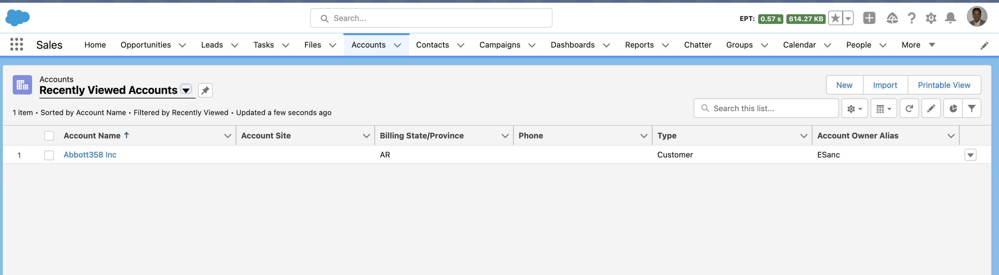

# How to access ui-api resources

## Get object info for all objects
```
sfdx mohanc:ui:uiapi -u mohan.chinnappan.n_ea2@gmail.com -r object-info > object-info.json

```

- [object-info.json](./object-info.json)

## Get object info for 'Account'
```
sfdx mohanc:ui:uiapi -u mohan.chinnappan.n_ea2@gmail.com -r object-info/Account > object-info_Account.json
```
- [object-info_Account.json](./object-info_Account.json)

## record-ui for a given record
```
sfdx mohanc:ui:uiapi -u mohan.chinnappan.n_ea2@gmail.com -r record-ui/0013h00000FfgB5AAJ > record-ui_0013h00000FfgB5AAJ.json
```

- [record-ui_0013h00000FfgB5AAJ.json](./record-ui_0013h00000FfgB5AAJ.json)


## List views

### List views for Account
```
sfdx mohanc:ui:uiapi -u mohan.chinnappan.n_ea2@gmail.com -r list-records/00B3h000008IZY2EAO > Account_listView.json
```
- [Account_listViews.json](./Account_listViews.json)


### List views records for an  Account list view
```
sfdx mohanc:ui:uiapi -u mohan.chinnappan.n_ea2@gmail.com -r list-records/00B3h000008IZY2EAO > Account_listView.json
```
- [Account_listView.json](./Account_listView.json)



