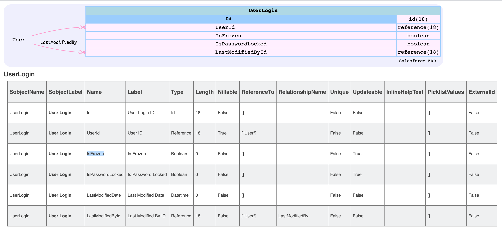

# Using UserLogin sObject

## ERD


## How to Freeze or unfreeze multiple Users at once:
- [Knowledge Article](https://help.salesforce.com/articleView?id=000337702&type=1&mode=1)


## Querying UserObject
```sql

SELECT Id, UserId, IsFrozen
FROM UserLogin

```
### Results
```
$ sfdx mohanc:data:query -q ~/.ea/userLogin.soql -u  mohan.chinnappan.n_ea2@gmail.com -f JSON
```
```json
[
  {
    attributes: {
      type: 'UserLogin',
      url: '/services/data/v50.0/sobjects/UserLogin/0Yw3h000001pnL3CAI'
    },
    Id: '0Yw3h000001pnL3CAI',
    UserId: '0053h000003de6bAAA',
    IsFrozen: false
  },
  {
    attributes: {
      type: 'UserLogin',
      url: '/services/data/v50.0/sobjects/UserLogin/0Yw3h000001pnL4CAI'
    },
    Id: '0Yw3h000001pnL4CAI',
    UserId: '0053h000003de6dAAA',
    IsFrozen: false
  },
  {
    attributes: {
      type: 'UserLogin',
      url: '/services/data/v50.0/sobjects/UserLogin/0Yw3h000001pnL5CAI'
    },
    Id: '0Yw3h000001pnL5CAI',
    UserId: '0053h000003de6wAAA',
    IsFrozen: false
  },
  {
    attributes: {
      type: 'UserLogin',
      url: '/services/data/v50.0/sobjects/UserLogin/0Yw3h000001pnL6CAI'
    },
    Id: '0Yw3h000001pnL6CAI',
    UserId: '0053h000003de6xAAA',
    IsFrozen: false
  },
  {
    attributes: {
      type: 'UserLogin',
      url: '/services/data/v50.0/sobjects/UserLogin/0Yw3h000001pnL7CAI'
    },
    Id: '0Yw3h000001pnL7CAI',
    UserId: '0053h000003de6yAAA',
    IsFrozen: false
  },
  {
    attributes: {
      type: 'UserLogin',
      url: '/services/data/v50.0/sobjects/UserLogin/0Yw3h000001pnL8CAI'
    },
    Id: '0Yw3h000001pnL8CAI',
    UserId: '0053h000003de6zAAA',
    IsFrozen: false
  },
  {
    attributes: {
      type: 'UserLogin',
      url: '/services/data/v50.0/sobjects/UserLogin/0Yw3h000001pnL9CAI'
    },
    Id: '0Yw3h000001pnL9CAI',
    UserId: '0053h000003de70AAA',
    IsFrozen: false
  },
  {
    attributes: {
      type: 'UserLogin',
      url: '/services/data/v50.0/sobjects/UserLogin/0Yw3h000001pnLACAY'
    },
    Id: '0Yw3h000001pnLACAY',
    UserId: '0053h000003de71AAA',
    IsFrozen: false
  },
  {
    attributes: {
      type: 'UserLogin',
      url: '/services/data/v50.0/sobjects/UserLogin/0Yw3h000001pnLBCAY'
    },
    Id: '0Yw3h000001pnLBCAY',
    UserId: '0053h000003de72AAA',
    IsFrozen: false
  },
  {
    attributes: {
      type: 'UserLogin',
      url: '/services/data/v50.0/sobjects/UserLogin/0Yw3h000001pnLCCAY'
    },
    Id: '0Yw3h000001pnLCCAY',
    UserId: '0053h000003de73AAA',
    IsFrozen: false
  },
  {
    attributes: {
      type: 'UserLogin',
      url: '/services/data/v50.0/sobjects/UserLogin/0Yw3h000001pnLDCAY'
    },
    Id: '0Yw3h000001pnLDCAY',
    UserId: '0053h000003de74AAA',
    IsFrozen: false
  },
  {
    attributes: {
      type: 'UserLogin',
      url: '/services/data/v50.0/sobjects/UserLogin/0Yw3h000001pnLECAY'
    },
    Id: '0Yw3h000001pnLECAY',
    UserId: '0053h000003de75AAA',
    IsFrozen: false
  },
  {
    attributes: {
      type: 'UserLogin',
      url: '/services/data/v50.0/sobjects/UserLogin/0Yw3h000001pnLFCAY'
    },
    Id: '0Yw3h000001pnLFCAY',
    UserId: '0053h000003de76AAA',
    IsFrozen: false
  },
  {
    attributes: {
      type: 'UserLogin',
      url: '/services/data/v50.0/sobjects/UserLogin/0Yw3h000001pnLGCAY'
    },
    Id: '0Yw3h000001pnLGCAY',
    UserId: '0053h000003de77AAA',
    IsFrozen: false
  },
  {
    attributes: {
      type: 'UserLogin',
      url: '/services/data/v50.0/sobjects/UserLogin/0Yw3h000001pnLHCAY'
    },
    Id: '0Yw3h000001pnLHCAY',
    UserId: '0053h000003de78AAA',
    IsFrozen: false
  },
  {
    attributes: {
      type: 'UserLogin',
      url: '/services/data/v50.0/sobjects/UserLogin/0Yw3h000001pnLICAY'
    },
    Id: '0Yw3h000001pnLICAY',
    UserId: '0053h000003de79AAA',
    IsFrozen: false
  },
  {
    attributes: {
      type: 'UserLogin',
      url: '/services/data/v50.0/sobjects/UserLogin/0Yw3h000001pnLJCAY'
    },
    Id: '0Yw3h000001pnLJCAY',
    UserId: '0053h000003de7AAAQ',
    IsFrozen: false
  },
  {
    attributes: {
      type: 'UserLogin',
      url: '/services/data/v50.0/sobjects/UserLogin/0Yw3h000001pnLKCAY'
    },
    Id: '0Yw3h000001pnLKCAY',
    UserId: '0053h000003de7BAAQ',
    IsFrozen: false
  },
  {
    attributes: {
      type: 'UserLogin',
      url: '/services/data/v50.0/sobjects/UserLogin/0Yw3h000001pnLLCAY'
    },
    Id: '0Yw3h000001pnLLCAY',
    UserId: '0053h000003de7CAAQ',
    IsFrozen: false
  },
  {
    attributes: {
      type: 'UserLogin',
      url: '/services/data/v50.0/sobjects/UserLogin/0Yw3h000001pnLMCAY'
    },
    Id: '0Yw3h000001pnLMCAY',
    UserId: '0053h000003de7DAAQ',
    IsFrozen: false
  },
  {
    attributes: {
      type: 'UserLogin',
      url: '/services/data/v50.0/sobjects/UserLogin/0Yw3h000001pnLNCAY'
    },
    Id: '0Yw3h000001pnLNCAY',
    UserId: '0053h000003de7EAAQ',
    IsFrozen: false
  },
  {
    attributes: {
      type: 'UserLogin',
      url: '/services/data/v50.0/sobjects/UserLogin/0Yw3h000001pnLOCAY'
    },
    Id: '0Yw3h000001pnLOCAY',
    UserId: '0053h000003de7FAAQ',
    IsFrozen: false
  },
  {
    attributes: {
      type: 'UserLogin',
      url: '/services/data/v50.0/sobjects/UserLogin/0Yw3h000001pnLPCAY'
    },
    Id: '0Yw3h000001pnLPCAY',
    UserId: '0053h000002xQ5sAAE',
    IsFrozen: false
  },
  {
    attributes: {
      type: 'UserLogin',
      url: '/services/data/v50.0/sobjects/UserLogin/0Yw3h000001pnLSCAY'
    },
    Id: '0Yw3h000001pnLSCAY',
    UserId: '0053h000003de7GAAQ',
    IsFrozen: false
  }
]

```
