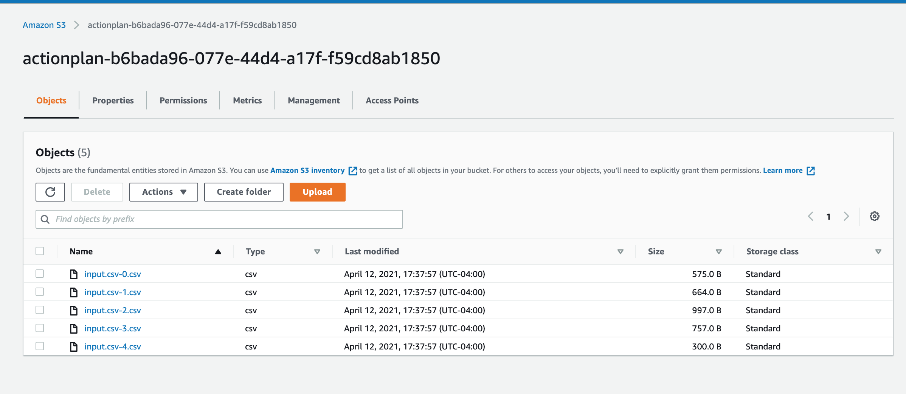
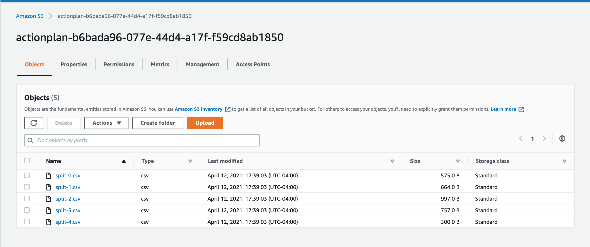

# Splitting a large CSV into a splits of given size
- Plugin version 0.0.156 is required

## Topics
- [Usage](#usage)
- [Split files only](#fsplit)
- [Split files and load into S3](#fsplits3)
- [Read file from web and Split files and load into s3](#hsplits3)


<a name='usage'></a>

## Usage
```

Split the given data file into multiple files based on given  split size. Optionally loads into a S3 Bucket and optionally reads from a http resource

USAGE
  $ sfdx mohanc:data:util:splitLines

OPTIONS
  -b, --bucketname=bucketname                     S3 Bucket Name to load into - optional
  -i, --inputfilename=inputfilename               Input Data file in CSV format you want to do the splitting
  -r, --httpurl=httpurl                           http resource to for the input file - optional
  -s, --size=size                                 Split Size in number of lines
  --json                                          format output as json
  --loglevel=(trace|debug|info|warn|error|fatal)  logging level for this command invocation

EXAMPLE

       ** Split the given data file into multiple files based on given  split size. Optionally loads into a S3 Bucket and optionally reads from a http resource **
    
       sfdx mohanc:data:util:splitLines -i <Input CSV file> -s '<Split size>' -b [S3 Bucket Name] -r [http resource]
       Examples:
       sfdx mohanc:data:util:splitLines -i largeData.csv -s 1000

       sfdx mohanc:data:util:splitLines -i input.csv -s 4 -b actionplan-b6bada96-077e-44d4-a17f-f59cd8ab1850

       sfdx mohanc:data:util:splitLines -i largeData.csv -s 1000 -b bucket1 -r http://localhost:7010/csv-utils/input.csv


```

```
$ sfdx mohanc:data:util:splitLines -i input.csv -s 4

```

```
SplitLines completed. { totalChunks: 5, options: { delimiter: '\n', lineLimit: '4' } }

```


```
$ cat input.csv
"sobjectName","sobjectLabel","name","label","type","length","nillable","referenceTo","relationshipName","unique","updateable","inlineHelpText","picklistValues","externalId"
"ActionPlan","Action Plan","Id","Action Plan ID","id",18,false,"[]",,false,false,,"[]",false
"ActionPlan","Action Plan","OwnerId","Owner ID","reference",18,false,"[""Group"",""User""]","Owner",false,true,,"[]",false
"ActionPlan","Action Plan","IsDeleted","Deleted","boolean",0,false,"[]",,false,false,,"[]",false
"ActionPlan","Action Plan","Name","Name","string",255,false,"[]",,false,true,,"[]",false
"ActionPlan","Action Plan","CreatedDate","Created Date","datetime",0,false,"[]",,false,false,,"[]",false
"ActionPlan","Action Plan","CreatedById","Created By ID","reference",18,false,"[""User""]","CreatedBy",false,false,,"[]",false
"ActionPlan","Action Plan","LastModifiedDate","Last Modified Date","datetime",0,false,"[]",,false,false,,"[]",false
"ActionPlan","Action Plan","LastModifiedById","Last Modified By ID","reference",18,false,"[""User""]","LastModifiedBy",false,false,,"[]",false
"ActionPlan","Action Plan","SystemModstamp","System Modstamp","datetime",0,false,"[]",,false,false,,"[]",false
"ActionPlan","Action Plan","LastViewedDate","Last Viewed Date","datetime",0,true,"[]",,false,false,,"[]",false
"ActionPlan","Action Plan","LastReferencedDate","Last Referenced Date","datetime",0,true,"[]",,false,false,,"[]",false
"ActionPlan","Action Plan","TargetId","Target Record ID","reference",18,true,"[""Account"",""BusinessMilestone"",""Campaign"",""Case"",""Claim"",""Contact"",""Contract"",""FinServ__AssetsAndLiabilities__c"",""FinServ__Card__c"",""FinServ__FinancialAccount__c"",""FinServ__FinancialGoal__c"",""FinServ__FinancialHolding__c"",""InsurancePolicy"",""InsurancePolicyCoverage"",""Lead"",""Opportunity"",""PersonLifeEvent"",""ResidentialLoanApplication""]","Target",false,false,,"[]",false
"ActionPlan","Action Plan","ActionPlanTemplateVersionId","Action Plan Template Version ID","reference",18,false,"[""ActionPlanTemplateVersion""]","ActionPlanTemplateVersion",false,false,,"[]",false
"ActionPlan","Action Plan","ActionPlanType","Action Plan Type","picklist",255,false,"[]",,false,false,,"[""Industries""]",false
"ActionPlan","Action Plan","ActionPlanState","Status","picklist",40,false,"[]",,false,true,,"[""Not Started"",""In Progress"",""Canceled"",""Completed""]",false
"ActionPlan","Action Plan","StartDate","Start Date","date",0,false,"[]",,false,false,,"[]",false
"ActionPlan","Action Plan","IsUsingHolidayHours","Skip Nonwork Days For Tasks","boolean",0,false,"[]",,false,false,,"[]",false
```

```
$ cat input.csv-0.csv
```
```
"sobjectName","sobjectLabel","name","label","type","length","nillable","referenceTo","relationshipName","unique","updateable","inlineHelpText","picklistValues","externalId"
"ActionPlan","Action Plan","Id","Action Plan ID","id",18,false,"[]",,false,false,,"[]",false
"ActionPlan","Action Plan","OwnerId","Owner ID","reference",18,false,"[""Group"",""User""]","Owner",false,true,,"[]",false
"ActionPlan","Action Plan","IsDeleted","Deleted","boolean",0,false,"[]",,false,false,,"[]",false
"ActionPlan","Action Plan","Name","Name","string",255,false,"[]",,false,true,,"[]",false
```
```
$ cat input.csv-1.csv
```
```

"sobjectName","sobjectLabel","name","label","type","length","nillable","referenceTo","relationshipName","unique","updateable","inlineHelpText","picklistValues","externalId"
"ActionPlan","Action Plan","CreatedDate","Created Date","datetime",0,false,"[]",,false,false,,"[]",false
"ActionPlan","Action Plan","CreatedById","Created By ID","reference",18,false,"[""User""]","CreatedBy",false,false,,"[]",false
"ActionPlan","Action Plan","LastModifiedDate","Last Modified Date","datetime",0,false,"[]",,false,false,,"[]",false
"ActionPlan","Action Plan","LastModifiedById","Last Modified By ID","reference",18,false,"[""User""]","LastModifiedBy",false,false,,"[]",false
```

- ...

## Split and 
<a name='fsplits3'></a>
## Split files and load into S3
```
$ sfdx mohanc:data:util:splitLines -i input.csv -s 4 -b actionplan-b6bada96-077e-44d4-a17f-f59cd8ab1850
```

```
SplitLines and loading into S3 : succeeded. { totalChunks: 5, options: { delimiter: '\n', lineLimit: '4' } }

```


<a name='hsplits3'</a>
## Read file from web and Split files and load into s3
```
$ sfdx mohanc:data:util:splitLines -i input.csv -s 4 -b actionplan-b6bada96-077e-44d4-a17f-f59cd8ab1850 -r  http://localhost:7010/csv-utils/input.csv -h
```
```
SplitLines and loading into S3 : succeeded. { totalChunks: 5, options: { delimiter: '\n', lineLimit: '4' } }

```





